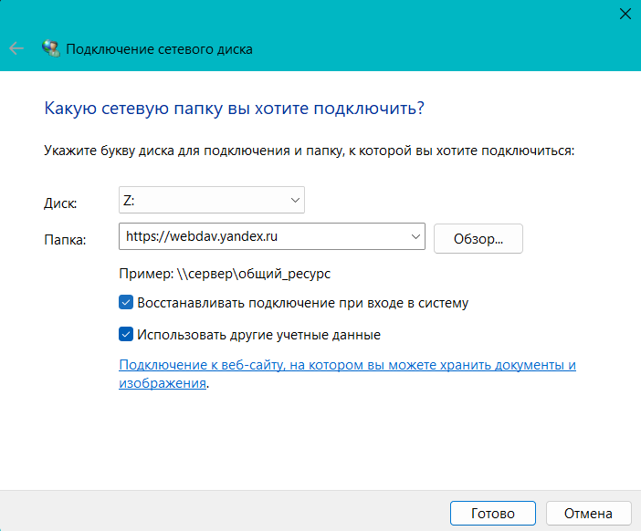
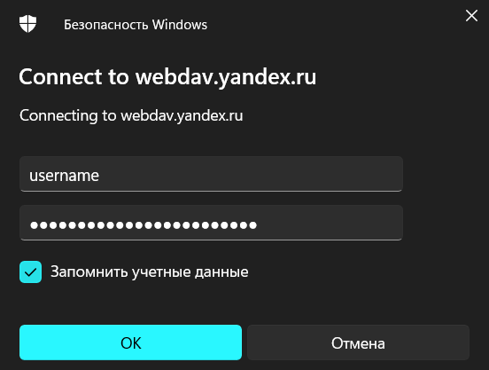
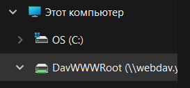

# Подключение Яндекс Диска в качестве сетевого диска по протоколу WebDAV для ОС Windows 11

Протокол `WebDAV` позволяет подключить к компьютеру облачное хранилище. Подключенный диск будет отображаться как отдельная папка в проводнике.

Для подключения Яндекс Диска по протоколу WebDAV:

1. [Зарегистрируйте](https://passport.yandex.ru/registration) аккаунт Яндекс ID. 

    Для дополнительных сведений см. [инструкцию](https://yandex.ru/support/id/authorization/registration.html).

1.  Создайте пароль приложения WebDAV по [инструкции](https://yandex.ru/support/id/authorization/app-passwords.html#app-passwords__create).

1. Подключите Яндекс Диск в качестве сетевого диска на персональном компьютере.
    
    1. Нажмите правой кнопкой мыши на значок `Пуск` и выберите `Проводник`.

    1. В открывшемся окне нажмите правой кнопкой мыши на значок `Этот компьютер`, выберите `Показать дополнительные параметры`, далее - `Подключить сетевой диск...`
    1. В появившемся окне в поле `Папка` введите адрес `https://webdav.yandex.ru`.
    1. Поставьте галочку `Использовать другие учетные данные`, нажмите `Готово`.
    
    1. В появившемся окне заполните учетные данные. `Имя пользователя` - это ваш логин Яндекс ID, пароль - `пароль` приложения, созданный на шаге 2. 
    
    1. Поставьте галочку `Запомнить учетные данные`, нажмите `Ок`.

    Сетевой диск станет доступен в проводнике, наряду с другими вашими дисками.
    